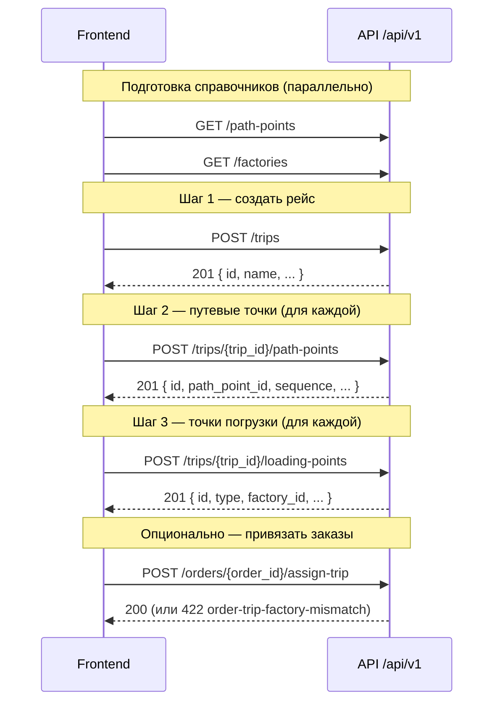

# Trips — инструкция для фронтенда

Актуально по контракту [`API_USAGE.md`](API_USAGE.md) (раздел **Trips**).

Исходники контрактов:

- рейс: [`app/schemas/trip.py`](app/schemas/trip.py) — `TripCreate`, `TripUpdate`, `TripRead`, `TripDetailRead`
- точки погрузки: [`app/schemas/loading_point.py`](app/schemas/loading_point.py) — `TripLoadingPointCreate`, `TripLoadingPointUpdate`, `LoadingPointRead`
- путевые точки рейса: [`app/schemas/trip_path_point.py`](app/schemas/trip_path_point.py) — `TripPathPointCreateRequest`, `TripPathPointUpdateRequest`, `TripPathPointRead`
- справочник путевых точек: [`app/schemas/path_point.py`](app/schemas/path_point.py) — `PathPointRead`

---

## Права доступа

| Операция | Роли |
|----------|------|
| Чтение `/api/v1/trips*` | `administrator`, `manager`, `logist`, `accountant`, `warehouse`, `forwarder`, `superuser` |
| Запись `/api/v1/trips*` | `administrator`, `manager`, `logist`, `accountant`, `warehouse`, `superuser` |
| Назначение заказов на рейс (`assign-trip`) | те же write-роли |

Все запросы — с `Authorization: Bearer <token>`.

---

## Общая схема потока

Создание рейса — **три отдельных шага**. Единой «создать всё сразу» ручки нет.



---

## Шаг 0. Подготовка справочников (до создания рейса)

Перед формой рейса загрузите:

1. **`GET /api/v1/path-points`** — справочник путевых точек (`id`, `name_ru`, `name_en`, `name_it`). Нужен для шага 2.
2. **`GET /api/v1/factories`** — список фабрик. Нужен для шага 3 (`type=factory`) и опционально для `factory_id` в путевых точках.

---

## Шаг 1. Создание рейса

**`POST /api/v1/trips`** → `201 Created`

### Body

```json
{
  "name": "Рейс #42"
}
```

### Опциональные поля

| Поле | Тип | Примечание |
|------|-----|------------|
| `status_name` | `TripStatus` | `new`, `in_transit`, `in_russia_customs`, `in_moscow_warehouse`, `unloaded` |
| `type_name` | `TripType` | сейчас только `normal` |
| `current_point_id` | `int \| null` | ID из справочника `path-points` |
| `current_point_name` | `string \| null` | свободный текст |
| `truck_plate` | `string \| null` | |
| `truck_company_name` | `string \| null` | |

### Response (`TripRead`)

```json
{
  "id": 15,
  "name": "Рейс #42",
  "status_name": null,
  "type_name": null,
  "current_point_id": null,
  "current_point_name": null,
  "truck_plate": null,
  "truck_company_name": null,
  "created_at": "2026-06-08T10:00:00Z"
}
```

**Сохраните `id`** — он нужен на шагах 2 и 3.

Ошибки: `422` при невалидном `current_point_id` (FK не найден).

---

## Шаг 2. Добавление путевых точек в рейс

Для каждой точки маршрута — отдельный запрос.

**`POST /api/v1/trips/{trip_id}/path-points`** → `201 Created`

### Body (required)

```json
{
  "path_point_id": 3,
  "sequence": 1
}
```

### Body (optional)

```json
{
  "factory_id": 7,
  "planned_at": "2026-06-10T08:00:00Z",
  "actual_at": null
}
```

### Правила

- `trip_id` — **только в URL**, не в body.
- `path_point_id` — ID из `GET /api/v1/path-points`.
- `sequence` — **уникален внутри рейса** (1, 2, 3…). Дубликат → `422`.
- `factory_id` — опционально, но если передан — фабрика должна существовать.
- Список: `GET /api/v1/trips/{trip_id}/path-points` — сортировка по `sequence`.
- Редактирование: `PATCH /api/v1/trips/{trip_id}/path-points/{trip_path_point_id}`.
- **Удаления отдельной путевой точки нет** — только PATCH или удаление всего рейса.

### Response (`TripPathPointRead`)

```json
{
  "id": 101,
  "trip_id": 15,
  "path_point_id": 3,
  "factory_id": 7,
  "sequence": 1,
  "planned_at": "2026-06-10T08:00:00Z",
  "actual_at": null
}
```

### Рекомендация для UI

- Показывать `name_ru` из справочника `path-points`, отправлять `path_point_id`.
- `sequence` задавать порядком в списке (drag-and-drop → перенумерация через PATCH).

---

## Шаг 3. Добавление точек погрузки в рейс

Для каждой точки погрузки — отдельный запрос.

**`POST /api/v1/trips/{trip_id}/loading-points`** → `201 Created`

### Body (required)

```json
{
  "type": "factory",
  "name": "Factory Milano",
  "address": "Via Roma 1"
}
```

### Body (optional)

```json
{
  "factory_id": 7,
  "postcode": "20100",
  "country": "Italy",
  "city": "Milan",
  "contact_name": "Marco",
  "phone": "+39...",
  "planned_loading_at": "2026-06-10T08:00:00Z",
  "actual_loading_at": null,
  "is_completed": false
}
```

### Типы (`LoadingPointType`)

| `type` | `factory_id` | Описание |
|--------|--------------|----------|
| `factory` | **обязателен** | Погрузка на фабрике |
| `forwarder_warehouse` | **должен быть `null`** | Склад экспедитора |

### Важно

- `trip_id` — **только в URL**.
- Данные — **snapshot на момент рейса**. Сервер **не копирует** адрес/контакты из карточки фабрики автоматически — фронт сам подставляет из `GET /api/v1/factories/{factory_id}` (и при необходимости loading-addresses).
- Редактирование: `PATCH /api/v1/trips/{trip_id}/loading-points/{loading_point_id}`.
- При смене `type` сервер проверяет согласованность `factory_id` с итоговым состоянием.
- **Удаления отдельной точки погрузки нет**.

### Response (`LoadingPointRead`)

```json
{
  "id": 55,
  "trip_id": 15,
  "factory_id": 7,
  "type": "factory",
  "name": "Factory Milano",
  "address": "Via Roma 1",
  "postcode": "20100",
  "country": "Italy",
  "city": "Milan",
  "contact_name": "Marco",
  "phone": "+39...",
  "planned_loading_at": "2026-06-10T08:00:00Z",
  "actual_loading_at": null,
  "is_completed": false
}
```

---

## Шаг 4 (опционально). Проверка и назначение заказов

После шагов 2–3 можно привязать заказы.

**`POST /api/v1/orders/{order_id}/assign-trip`**

```json
{ "trip_id": 15 }
```

или bulk: **`POST /api/v1/orders/bulk/assign-trip`**

```json
{
  "order_ids": [101, 102],
  "trip_id": 15
}
```

### Совместимость по `factory_id`

Заказ можно назначить на рейс, только если `order.factory_id` совпадает с:

- **`loading_point.factory_id`** в рейсе, **или**
- **`trip_path_point.factory_id`** в рейсе.

Иначе → **`422 order-trip-factory-mismatch`**.

Поэтому перед назначением заказов убедитесь, что для нужных фабрик добавлены loading points (`type=factory`) и/или path points с `factory_id`.

`trip_id: null` — снять заказ с рейса.

---

## Чтение собранного рейса

**`GET /api/v1/trips/{trip_id}`** — полная карточка:

- поля рейса;
- `loading_points[]`;
- `path_points[]` (с optional `factory_id`), отсортированы по `sequence`.

Удобно после wizard'а или для экрана редактирования.

---

## Типичные ошибки (422)

| Ситуация | Код/сообщение |
|----------|---------------|
| `type=factory` без `factory_id` | validation error |
| `type=forwarder_warehouse` с `factory_id` | validation error |
| Дубликат `sequence` в path-points | validation error |
| Несуществующий `path_point_id` / `factory_id` | validation error |
| Назначение заказа без совпадения фабрики | `order-trip-factory-mismatch` |

---

## Практические рекомендации для UI

1. **Wizard из 3 шагов**: рейс → маршрут (path-points) → погрузки (loading-points).
2. **Не блокировать шаг 3 шагом 2** на уровне API — они независимы, но для `assign-trip` нужна хотя бы одна точка с нужным `factory_id`.
3. **При выборе фабрики** для loading point — префиллить `name`, `address`, `city`, `country`, `contact_name`, `phone` из карточки фабрики; пользователь может отредактировать (это snapshot).
4. **После каждого POST** сохранять `id` созданных сущностей для последующих PATCH.
5. **Удаление рейса** — только `POST /api/v1/trips/bulk/delete`, и только если **нет привязанных заказов**; вместе с рейсом удаляются все его loading/path points.
6. **Редактирование рейса** (имя, статус, машина): `PATCH /api/v1/trips/{trip_id}`.

---

## Минимальный пример полного цикла

```http
POST /api/v1/trips
{ "name": "Июнь-08" }
→ trip_id = 15

POST /api/v1/trips/15/path-points
{ "path_point_id": 1, "sequence": 1, "factory_id": 7 }
POST /api/v1/trips/15/path-points
{ "path_point_id": 4, "sequence": 2 }

POST /api/v1/trips/15/loading-points
{
  "type": "factory",
  "factory_id": 7,
  "name": "Factory A",
  "address": "Street 1",
  "city": "Milan",
  "country": "Italy"
}

GET /api/v1/trips/15
→ полная карточка

POST /api/v1/orders/201/assign-trip
{ "trip_id": 15 }
```
